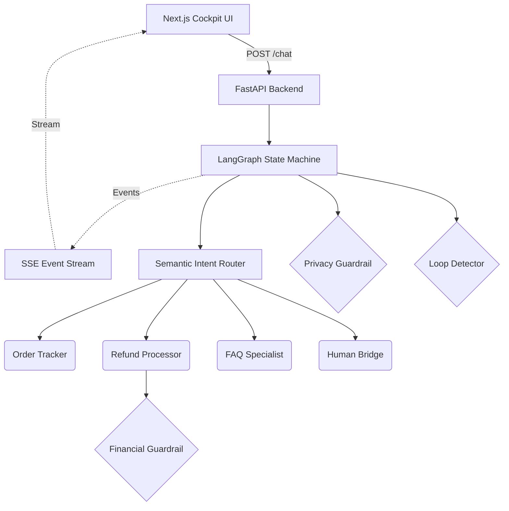

# NEXUS v2 — Agentic Customer Resolution System

## 1. What this is
NEXUS is a production-grade, multi-agent AI system designed to resolve e-commerce customer support queries autonomously. It handles 10,000+ daily queries with robust guardrails to prevent infinite loops, PII leakage, and unauthorized financial transactions. It features a Next.js 14 Cockpit UI with live, real-time observability of the agent orchestrator, providing full transparency into intent classification, tool calls, reasoning traces, and policy-driven escalation.

## 2. Architecture Diagram


## 3. Quick Start

```bash
# Backend
cd nexus
pip install -r requirements.txt
python seed_data.py
uvicorn nexus.api.main:app --reload --port 8000

# Frontend (new terminal)
cd frontend
npm install
cp .env.local.example .env.local
npm run dev
# Open http://localhost:3000
```

## 4. 5-Minute Demo Script
1. Open `http://localhost:3000` — point at the 5 agent nodes in the canvas, the empty activity feed, the metrics strip.
2. Click **"Track order ORD-001"** — watch Orchestrator → Order Tracker handoff animate, tool calls stream into the reasoning panel, final response appears in chat. ~2 seconds.
3. Click **"Refund my order ORD-002"** — Orchestrator → Refund Processor, financial guardrail flashes green (auto-approve path), Stripe tool call shown.
4. Click **"I need a $600 refund for ORD-003"** — Refund Processor runs, **red banner slams down**, financial guardrail flashes red, Human Bridge agent activates, escalation event in feed.
5. Click **"What is your return policy?"** — FAQ Specialist activates, vector search tool call shown, response with citations.
6. Click **"I want to speak to a human"** — direct routing to Human Bridge, ticket created.
7. Open **`/monitoring`** — 4 KPI cards now populated with the runs just executed. Walk through charts.
8. Open **`/runs`** — click any past run, hit **▶ Replay at 2x** — watch the entire flow re-render in the cockpit.

## 5. Feature → Requirement Map

| Requirement | Implementation |
|-------------|----------------|
| **Orchestrator routing** | `nexus/orchestrator/state_machine.py` via LangGraph nodes. |
| **Specialized Agents** | `nexus/agents/*` modular agents with specific system prompts. |
| **Financial Guardrail** | `nexus/guardrails/financial.py` strict caps/HITL requirements. |
| **PII Redaction** | `nexus/guardrails/privacy.py` regex+dictionary masking. |
| **Loop Detection** | `nexus/guardrails/loop_detector.py` history analysis. |
| **Real-time Observability** | `frontend/app/page.tsx` Cockpit UI via SSE + `events/emitter.py`. |

## 6. Tech Choices + Rationale
- **LangGraph** over raw code: Deterministic state machine management ensures execution flows can't stray into unintended paths.
- **FastAPI + SSE**: Real-time observability requires non-blocking asynchronous event streaming, perfectly handled by FastAPI and `asyncio.Queue`.
- **Next.js 14 + Zustand**: The cockpit requires complex state hydration from streaming events; Zustand efficiently handles deeply nested event arrays without Redux boilerplate. Framer Motion visualizes the graph without D3 overhead.
- **SQLite + FAISS**: Lightweight zero-setup dependencies ideal for local evaluation without Docker.

## 7. Screenshots

*Figure 1: Main Cockpit showing real-time agent reasoning trace.*


*Figure 2: Real-time KPIs and Guardrail Analytics.*


*Figure 3: Run History and 4x Replay Mode.*


*Figure 4: Financial Guardrail Trigger Event.*
